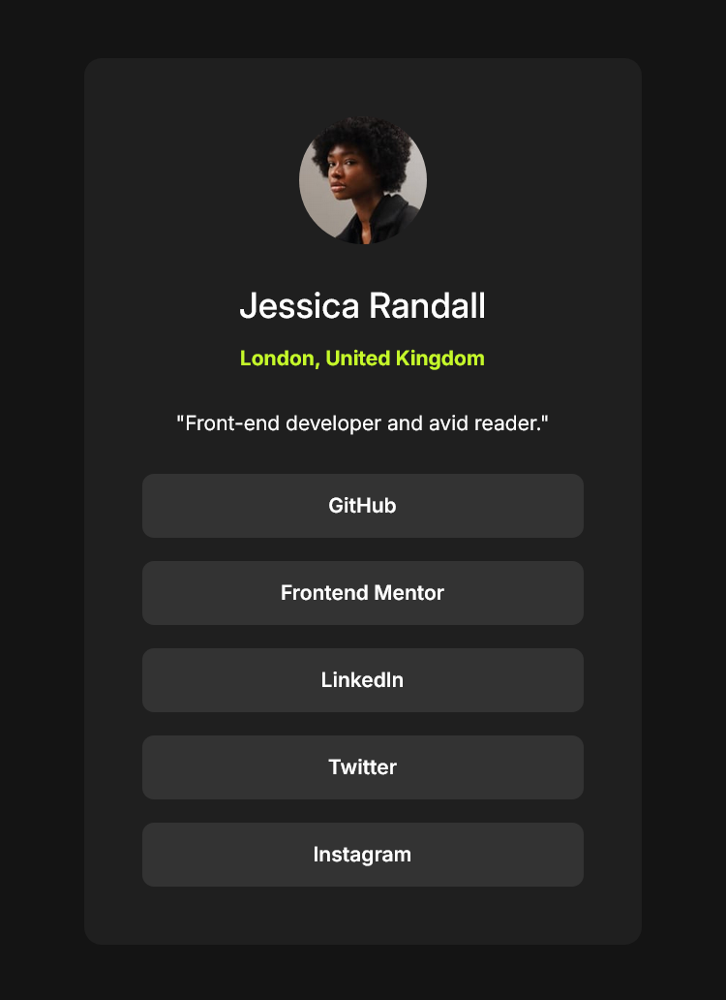

# Frontend Mentor - Social links profile solution

This is a solution to the [Social links profile challenge on Frontend Mentor](https://www.frontendmentor.io/challenges/social-links-profile-UG32l9m6dQ). Frontend Mentor challenges help you improve your coding skills by building realistic projects. 

## Table of contents

- [Overview](#overview)
  - [The challenge](#the-challenge)
  - [Screenshot](#screenshot)
  - [Links](#links)
- [My process](#my-process)
  - [Built with](#built-with)
  - [What I learned](#what-i-learned)
  - [Useful resources](#useful-resources)
- [Author](#author)


## Overview

### The challenge

Users should be able to:

- See hover and focus states for all interactive elements on the page

### Screenshot




### Links

- Solution URL: [Add solution URL here](https://your-solution-url.com)
- Live Site URL: [Add live site URL here](https://your-live-site-url.com)

## My process

### Built with

- Semantic HTML5 markup
- CSS custom properties
- Flexbox
- Mobile-first workflow


### What I learned

I know the design comp has a wider width for the tablet-sized display presentation but I really did not like how this component looked at that size. Instead, I stuck with a simpler width calculation using `clamp()` to achieve my desired dimensions. The `clamp()` function came in handy for handling the card's padding shift from mobile to larger screens. With such a small project it's nice to avoid using a media query for small changes like these.


```css
.card {
  width: clamp(18rem, 88vw, 24rem);
  padding: clamp(var(--spacing-300), 6vw, var(--spacing-500));
  font-size: var(--fs-300);
  text-align: center;
  background: var(--clr-gray-800);
  border-radius: var(--spacing-150);
}
```

### Useful resources

- [CSS Button Styling Guide](https://moderncss.dev/css-button-styling-guide/) - Stephanie Eckles is often my go-to accessibility resource and this project was no different. I have this button and link styling guide bookmarked.


## Author

- Website - [Matt Pahuta](https://www.mattpahuta.com)
- Frontend Mentor - [@mattpahuta](https://www.frontendmentor.io/profile/MattPahuta)
- Twitter - [@mattpahuta](https://www.twitter.com/MattPahuta)
- LinkedIn - [Matt Pahuta](www.linkedin.com/in/mattpahuta)

